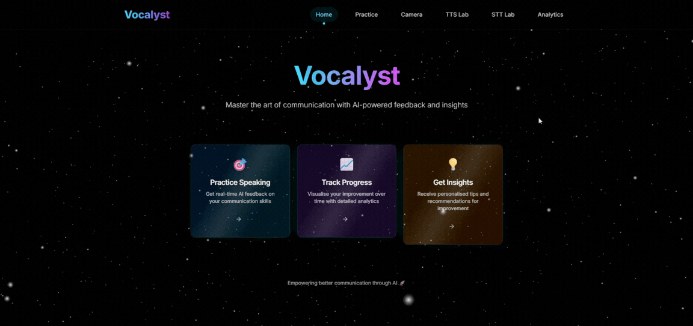
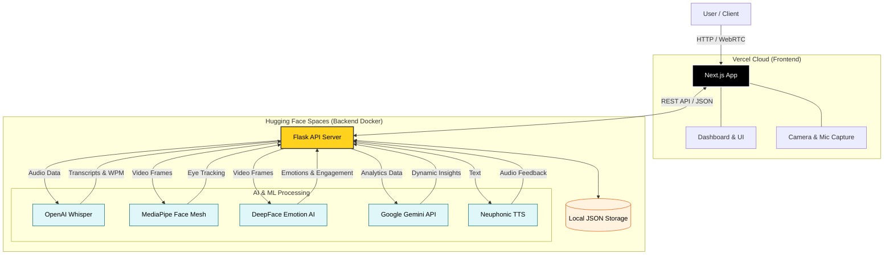
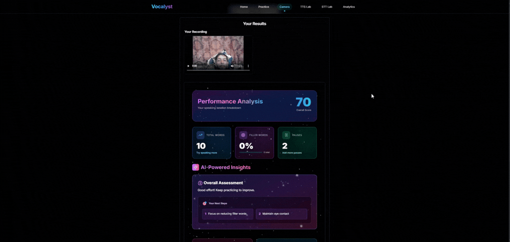
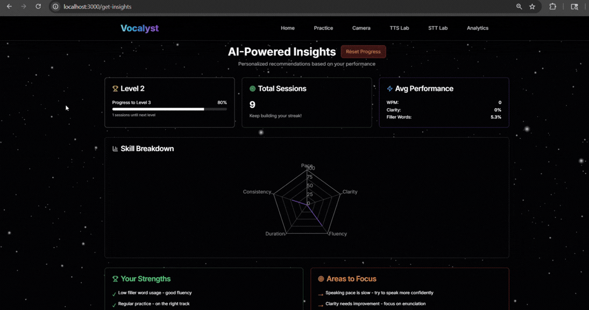
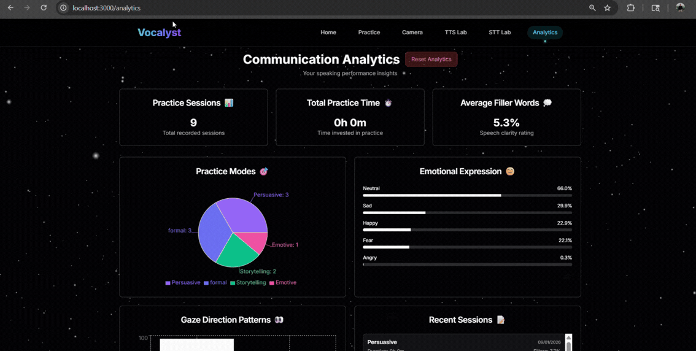

<div align="center">

# 🎙️ Vocalyst

### AI-Powered Communication Coaching Platform

*Elevate your public speaking and presentation skills through intelligent multimodal analysis*

[](https://github.com/Shreyyy07/Vocalyst-Main)
[](https://github.com/Shreyyy07/Vocalyst-Main/fork)
[](LICENSE)
[](https://www.docker.com/)

[Features](#-features) • [Quick Start](#-quick-start) • [Docker Deployment](#-docker-deployment) • [Technologies](#-technologies-used) • [Roadmap](#-roadmap)

</div>

---

## 📖 About Vocalyst

**Vocalyst** is an advanced AI-driven communication coaching platform that revolutionizes how individuals improve their public speaking and presentation skills. Unlike traditional tools that focus solely on text analysis, Vocalyst provides comprehensive, real-time multimodal feedback by analyzing:

- 🗣️ **Voice Analysis** - Speech fluency, pacing, tone, and delivery
- 😊 **Facial Expressions** - Emotional engagement and confidence levels
- 👁️ **Eye Contact** - Gaze tracking and audience engagement
- 📝 **Content Structure** - Logical coherence, vocabulary, and engagement

Communication is more than just words—it's about how you sound, how you look, and how you structure your message. Vocalyst bridges the gap left by conventional tools by offering a unified, intelligent solution for holistic communication improvement.

<div align="center">
  
</div>

---

## 🏗️ System Architecture




## ✨ Features

### 🎯 Core Capabilities

#### **1. Multimodal Practice Sessions**
- **Real-time Feedback** during presentations
- **Multiple Practice Modes**: General, Persuasive, Emotive, Debate, Storytelling
- **Camera & Audio Integration** for comprehensive analysis
- **Live Metrics Display** with instant feedback

<div align="center">
  
</div>

#### **2. Advanced Speech Analysis**
- **Speech Transcription** using OpenAI Whisper
- **Filler Word Detection** (um, uh, like, etc.) with frequency tracking
- **Words Per Minute (WPM)** measurement
- **Clarity Scoring** based on pronunciation and enunciation
- **Vocabulary Sophistication** tracking

#### **3. Visual & Emotional Intelligence**
- **Eye Contact Tracking** via MediaPipe
- **Facial Expression Analysis** using DeepFace
- **Emotion Detection** (neutral, happy, sad, angry, fear, surprise)
- **Engagement Estimation** through facial cues
- **Real-time Visual Feedback** during sessions

#### **4. AI-Powered Insights**
- **Dynamic Session Insights** generated by Google Gemini AI
- **Personalized Recommendations** based on performance
- **Trend Analysis** (improving/declining/stable metrics)
- **Strengths & Weaknesses** identification
- **Gamification** with level/XP system

<div align="center">
  
</div>

#### **5. Comprehensive Analytics**
- **Performance Dashboard** with historical trends
- **Session History** with detailed breakdowns
- **Progress Tracking** over time
- **Practice Mode Analytics** with distribution charts
- **Emotional Expression Patterns**
- **Reset Functionality** with data archiving

<div align="center">
  
</div>

#### **6. Text-to-Speech Integration**
- **Multiple Voice Options** (8 high-quality AI voices)
- **Speed Control** for customized playback
- **ElevenLabs & Neuphonic** integration
- **Practice Prompts** generation

---

## 💻 Usage

### Starting a Practice Session

1. **Navigate to Practice**
   - Click "Practice" in the navigation menu
   - Select a practice mode (General, Persuasive, Emotive, etc.)

2. **Record Your Presentation**
   - Allow camera and microphone permissions
   - Click "Start Recording"
   - Speak naturally while the system analyzes

3. **Receive Real-time Feedback**
   - Monitor live WPM, clarity, and filler word metrics
   - View eye contact and emotion tracking
   - Get instant visual feedback

4. **Review Detailed Analysis**
   - View comprehensive post-session breakdown
   - Get AI-generated personalized insights
   - See scores for fluency, coherence, and engagement
   - Receive actionable recommendations

### Analytics & Insights

**Analytics Dashboard** (`/analytics`):
- View aggregated performance metrics
- Track practice mode distribution
- Monitor emotional expression patterns
- Review recent session history
- Reset analytics with data archiving

**AI-Powered Insights** (`/get-insights`):
- Gamified progress tracking (Level/XP system)
- Skill breakdown radar chart
- Dynamic strengths and weaknesses
- Performance trends (improving/declining/stable)
- Personalized recommendations
- Reset progress functionality

---

## 🛠️ Technologies Used

### Frontend Stack

| Technology | Purpose |
|------------|---------|
| **Next.js 14** | React framework with SSR and production optimization |
| **React 18** | UI component library with hooks |
| **TypeScript** | Type-safe JavaScript development |
| **Tailwind CSS** | Utility-first styling framework |
| **Framer Motion** | Smooth animations and transitions |
| **Recharts** | Data visualization and charts |
| **Lucide React** | Modern icon library |

### Backend Stack

| Technology | Purpose |
|------------|---------|
| **Flask** | Python web framework for API |
| **Flask-CORS** | Cross-origin resource sharing |
| **Google Gemini AI** | Dynamic insights generation |
| **Neuphonic** | Enhanced TTS and speech processing |
| **ElevenLabs** | High-quality text-to-speech |

### AI/ML Models

| Model | Purpose | Performance |
|-------|---------|-------------|
| **OpenAI Whisper** | Speech-to-text transcription | State-of-the-art accuracy |
| **RoBERTa (large)** | Logical coherence detection | High performance |
| **XGBoost** | Speech fluency classification | 93% F1 Score |
| **Google Gemini Pro** | AI insights generation | Real-time analysis |

### Audio Processing

- **Librosa** - Audio feature extraction (MFCC, ZCR, energy)
- **Neuphonic** - Enhanced speech signal processing
- **OpenAI Whisper** - Accurate speech transcription
- **SoundDevice** - Real-time audio capture

### Computer Vision

- **MediaPipe** - Face landmark detection (68 points)
- **OpenCV** - Video processing and frame analysis
- **DeepFace** - Facial expression and emotion recognition
- **GazeTracking** - Eye contact estimation

### Deployment

- **Docker** - Containerization platform
- **Docker Compose** - Multi-container orchestration
- **Gunicorn** - Production WSGI server
- **Next.js Production Build** - Optimized frontend

---

## 🏗️ System Architecture


---

## 📁 Project Structure

```
Vocalyst-Main/
├── api/                          # Backend Flask API
│   ├── index.py                  # Main API endpoints
│   ├── simple_tts.py            # TTS subprocess handler
│   ├── tonality.py              # Tonality analysis
│   ├── data/                    # Session data storage
│   │   ├── sessions.json        # Practice sessions
│   │   └── archive/             # Archived data
│   ├── uploads/                 # User recordings
│   ├── Dockerfile               # Backend container config
│   └── requirements.txt         # Python dependencies
│
├── app/                         # Next.js frontend
│   ├── analytics/               # Analytics dashboard
│   ├── get-insights/           # AI insights page
│   ├── practice/               # Practice session interface
│   ├── camera/                 # Camera capture
│   ├── tts/                    # Text-to-speech lab
│   ├── Dockerfile              # Frontend container config
│   └── page.tsx                # Landing page
│
├── components/                  # Reusable React components
│   └── ui/                     # UI component library
│
├── docker-compose.yml          # Multi-container orchestration
├── .env.example               # Environment variables template
├── .dockerignore              # Docker ignore rules
├── .gitignore                 # Git ignore rules
├── package.json              # Node.js dependencies
├── requirements.txt          # Python dependencies
└── README.md                # This file
```

---

## 🎯 Key Features Breakdown

### Session Analysis
- **Real-time Metrics**: Live WPM, clarity, filler word tracking
- **Post-Session Breakdown**: Comprehensive analysis with scores
- **AI Insights**: Unique, personalized feedback per session
- **Historical Tracking**: Progress monitoring over time

### Analytics Dashboard
- **Aggregated Metrics**: Average WPM, filler %, clarity, duration
- **Practice Mode Distribution**: Visual breakdown by category
- **Emotional Patterns**: Emotion distribution across sessions
- **Recent Sessions**: Quick access to session history
- **Reset Functionality**: Archive and clear data

### AI-Powered Insights
- **Dynamic Analysis**: Real-time strengths/weaknesses calculation
- **Trend Detection**: Improving/declining/stable metrics
- **Personalized Recommendations**: Actionable improvement tips
- **Gamification**: Level/XP system for motivation
- **Skill Visualization**: Radar chart for skill breakdown

---

## 🗺️ Roadmap

### ✅ Completed Features
- [x] Docker containerization and deployment
- [x] Dynamic AI insights with Gemini API
- [x] Analytics reset with data archiving
- [x] Enhanced insights page with gamification
- [x] Skill breakdown radar chart
- [x] Performance trend analysis
- [x] Multi-voice TTS integration

### 🚀 Upcoming Features
- [ ] **Multilingual Support** - 20+ languages for global accessibility
- [ ] **Mobile Application** - iOS and Android native apps
- [ ] **Real-Time Coaching** - Live suggestions during presentations
- [ ] **Team Collaboration** - Multi-user sessions and peer feedback
- [ ] **Custom Training Modules** - Industry-specific templates
- [ ] **Integration APIs** - Zoom, Teams, Meet connectivity
- [ ] **Advanced Emotion AI** - Context-aware sentiment analysis
- [ ] **Voice Cloning** - Personalized TTS with user's voice
- [ ] **Presentation Templates** - Pre-built scenarios and scripts
- [ ] **Export Reports** - PDF/PowerPoint presentation reports

---

## 🔐 Security & Privacy

- **Local Processing**: All ML models run locally in Docker containers
- **No Data Sharing**: Session data stays on your machine
- **Environment Variables**: Secure API key management
- **Data Archiving**: Safe reset with backup functionality
- **CORS Protection**: Configured cross-origin policies

---

## 🤝 Contributing

We welcome contributions! Here's how:

1. Fork the repository
2. Create a feature branch (`git checkout -b feature/amazing-feature`)
3. Commit your changes (`git commit -m 'Add amazing feature'`)
4. Push to the branch (`git push origin feature/amazing-feature`)
5. Open a Pull Request

### Development Guidelines
- Follow PEP 8 for Python, ESLint for TypeScript
- Write meaningful commit messages
- Add comments for complex logic
- Update documentation as needed

---

## 📄 License

This project is licensed under the **MIT License** - see the [LICENSE](LICENSE) file for details.

---

## 👥 Author

- **Shreyyy07** - [GitHub Profile](https://github.com/Shreyyy07)

---

<div align="center">

**⭐ Star this repository if you find it helpful!**

**🐛 Found a bug?** [Open an issue](https://github.com/Shreyyy07/Vocalyst-Main/issues)

**💡 Have a feature idea?** [Start a discussion](https://github.com/Shreyyy07/Vocalyst-Main/discussions)

Made with ❤️ by Shreyyy07

</div>
